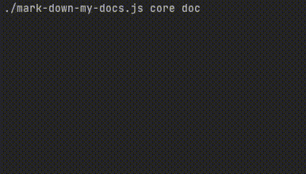

# mark-down-my-docs


`MarkDown` generator for `.js` and `.ts` source files with `jsdoc` documentation blocks 

## Why?
I was looking for an out-of-the-box, simple-to-setup documentation generator for a project of mine.
So I could easily generate my documentation for this project. 
It was harder than it sounded, too hard. Turns out that it didn't exist, or I could not find it. That's why I created this package, hope it helps you as much as it helped me.

### These were my demands
1. Runs right away after installation without extra setup.
2. Supports typescript and javascript.
3. Supports jsdoc.
4. Generates MarkDown files.
5. Has as few dependencies as possible.
6. Is fast
7. Is a node application

## Installation
```shell
npm install mark-down-my-docs 
```

## Usage
Run command with source directory and docs directory.

```shell
mark-down-my-docs src/ docs/
```


## Support
supports `.js` and `.ts` files with `js-doc` blocks

`runs on node 14.x and 16.x`

## Suggestions?
[Please create a new issue](https://github.com/mbroersen/mark-down-my-docs/issues/new)


## Example docs generated by `mark-down-my-docs`
### [View example of docs](./docs/Index.md)
